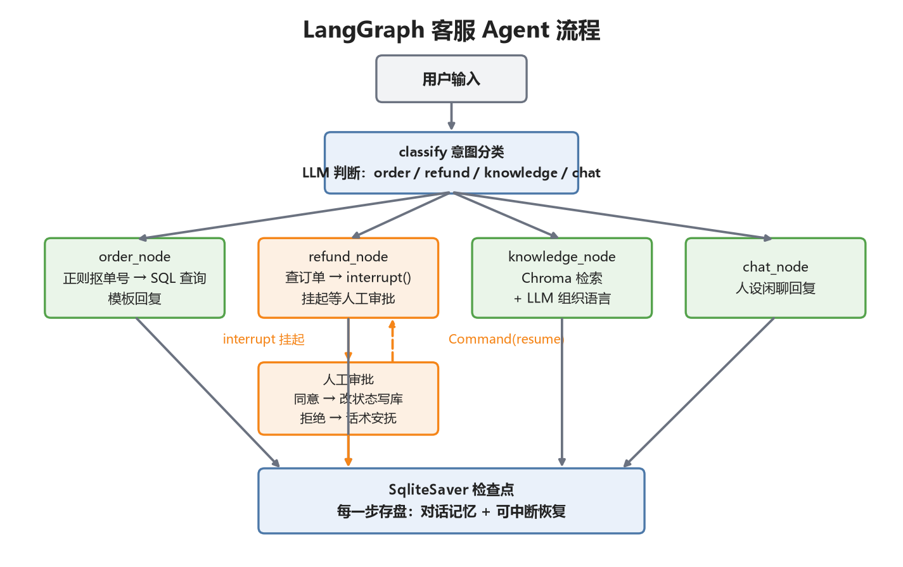

# LangGraph 客服 Agent

基于 LangGraph 的电商售后客服 Agent。和只会"答"的 RAG 问答不同，这个 Agent 能"办事"：查订单、答售后政策、办理退款——退款这类资金敏感操作会自动挂起，等人工审批后才继续执行。

## 功能特性

- **意图路由**：LLM 分类节点 + 条件边，订单 / 政策 / 退款 / 投诉 / 闲聊五类意图各走专属链路，分类失败兜底到闲聊分支
- **工具调用**：订单查询走 SQL 模板化回复（订单号、金额等关键数据不让模型转述），政策问答走 Chroma 检索 + LLM 组织语言
- **人工审批（Human-in-the-loop）**：退款通过 `interrupt()` 挂起，人工批复后 `Command(resume=...)` 恢复执行；写库操作严格放在中断点之后，保证只执行一次
- **多轮记忆**：SqliteSaver checkpointer 按 `thread_id` 持久化会话，进程重启对话可续接；追问"刚才那个订单到哪了？"不用重复单号（从会话历史回溯，确定性代码，不让模型猜）
- **防重复**：状态机拦截重复退款 / 已退款订单的二次申请

## 实测数据

| 指标 | 结果 |
|---|---|
| 意图路由正确率（五分类） | 9/10 |
| 评测场景全断言通过 | 10/11 |
| 退款 interrupt → 审批 → 恢复 → 写库 | 全链路通过 |
| 跨进程记忆持久化（重启后读回全部历史） | 通过 |
| 平均每轮耗时 | 1.00 秒 |
| 真实 token 消耗（19 轮评测） | ≈ 0.007 元 |

完整场景明细、已知边界和复现命令见 [评测报告.md](评测报告.md)。

## 技术栈

Python 3.12 / LangGraph 0.2（StateGraph + interrupt + SqliteSaver）/ DeepSeek / Chroma + DashScope Embedding / sqlite3

## 架构图



*图：classify 意图分类后条件边分流到各业务节点，refund 节点通过 interrupt 挂起等人工审批，全程由 SqliteSaver 检查点存盘。*

## 快速开始

```bash
pip install -r requirements.txt -i https://pypi.tuna.tsinghua.edu.cn/simple

# 环境变量（PowerShell）
$env:DEEPSEEK_API_KEY="sk-你的DeepSeekKey"
$env:DASHSCOPE_API_KEY="sk-你的阿里云百炼Key"   # 知识库Embedding用

python scripts/build_mock_db.py   # 初始化 mock 订单库 + 知识库（幂等，可重复跑）
python main.py
```

试这些话（建议按顺序，覆盖全部意图分支）：

| 输入 | 预期行为 |
|------|----------|
| `你好` | 闲聊分支，亲切回应 |
| `帮我查一下订单 E2025002` | 查订单：显示机械键盘运输中 |
| `退货运费谁承担？` | 查知识库：引用政策回答 |
| `我要退款，订单号 E2025001` | **挂起等审批**：程序打印订单卡片，等你输入"同意/拒绝" |
| `刚才那个订单到哪了？` | 多轮记忆：不用重复单号（试试换会话ID对比） |

## 设计要点

**为什么用图而不是 Chain？** Chain 是固定流水线，Agent 需要按情况动态选路——这次查订单、下次答政策。LangGraph 把状态机显式化：节点是纯函数、边是流转规则、条件边负责路由，可控性和可测试性都好于黑盒 Agent 执行器。

**interrupt 的恢复机制。** 第一次执行到 `interrupt()` 时抛出特殊异常，图暂停，状态已存进 checkpointer；用 `Command(resume=值)` 再次 invoke 时节点从头重跑，但 `interrupt()` 这次直接返回 resume 的值。因此中断点之前的代码必须幂等（查订单是只读 SQL，满足），写库放在中断点之后。

**工具为什么不用 function calling？** 意图种类少时，规则路由更可控、零额外 token。更重要的原则是工具执行必须是确定性代码——单号、金额这类数据绝不让模型"转述"。意图规模上来后可以平滑升级，工具函数签名兼容。

**会话历史怎么进模型的？** checkpointer 负责存取状态，业务节点再把滑动窗口内的历史消息拼进 prompt（`_chat_with_history`）。两层职责分开：持久化归框架，上下文组织归业务。

## 目录结构

```
├── main.py                     交互入口（命令行对话 + 人工审批交互）
├── agent/
│   ├── config.py               配置（环境变量读取）
│   ├── state.py                图状态定义（messages 追加式归并）
│   ├── tools.py                工具：查订单(sqlite)、查知识库(Chroma)
│   └── graph.py                图编排：意图路由 + 人工审批中断
├── scripts/
│   └── build_mock_db.py        初始化订单库 + 知识库（幂等）
├── docs/
│   └── 售后知识库示例.md        知识库语料
└── data/                       运行后生成：orders.db / checkpoints.db / chroma/
```
